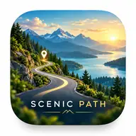

# Scenic Path — The Beautiful Way Finder

<div align="center">
  <a href="https://github.com/chekento/scenic-path-android/releases/download/v0.6.2-rc1/Scenic-Path-v0.6.2-rc1-debug.apk">
    
  </a>
</div>

<div align="center">

## ⬇️ [DOWNLOAD SCENIC PATH v0.6.2-rc1 APK](https://github.com/chekento/scenic-path-android/releases/download/v0.6.2-rc1/Scenic-Path-v0.6.2-rc1-debug.apk)

**Tap the large hero image above or the button text here — both download the current APK directly.**

[Release notes](https://github.com/chekento/scenic-path-android/releases/tag/v0.6.2-rc1) ·
[SHA-256](https://github.com/chekento/scenic-path-android/releases/download/v0.6.2-rc1/Scenic-Path-v0.6.2-rc1-debug.apk.sha256)

`cloud.kosch.scenicpath` · Android 16 / API 36 · `versionCode 39` · RC test build

</div>

---

<div align="center">
  
</div>

**Scenic Path** is a map-first Android journey planner built around one simple idea:

> **Choose the most beautiful route, not just the fastest.**

Instead of treating scenery as an afterthought, Scenic Path scores the **journey corridor itself** and lets the user decide how much extra time a more rewarding route is worth.

<div align="center">
  
</div>

## Choose what beautiful means

<div align="center">
  
</div>

Scenic Path can shape a journey around:

- 🌲 **Forests & protected landscapes**
- 🌊 **Lakes, rivers & coastline**
- ⛰️ **Mountains, relief & viewpoints**
- 🏛️ **Historic sights, monuments, architecture & culture**
- 🌳 **Parks & gardens**
- 🍽️ **Carefully selected food stops**
- 🛣️ **Quiet, winding & scenic roads**

The user defines a **detour budget** in extra time. Candidate journeys are ranked with a **ScenicScore**, and scenic upgrades stay inside that global budget instead of adding uncontrolled loops.

## Journey beautifully

<div align="center">
  
</div>

The experience is designed around three connected layers:

| Layer | What it does |
|---|---|
| **ScenicScore** | Ranks route quality instead of optimizing only time or distance |
| **Experience anchors** | Adds viewpoints, culture, nature, Smart Stops and optional food destinations |
| **Detour control** | Keeps the complete journey within the user-selected extra-time budget |

## Current Android build — v0.6.2-rc1

The current installable GitHub APK includes:

- Kotlin + Jetpack Compose UI
- MapLibre Native map
- start and destination search for towns, landmarks, streets and addresses
- ScenicScore-based route candidates
- Smart Stops and fixed Scenic POIs
- route-corridor POI discovery
- configurable scenic categories and detour budget
- live GPS navigation HUD
- route progress, remaining distance, ETA and current speed
- tilted follow camera and route overview
- off-route detection and reroute action
- next fixed Scenic POI and arrival detection
- Android TTS alerts
- provider boundary that keeps reusable production credentials out of the APK
- Scenic Path adaptive launcher icon and product branding

### APK

**Direct download:**  
[Scenic-Path-v0.6.2-rc1-debug.apk](https://github.com/chekento/scenic-path-android/releases/download/v0.6.2-rc1/Scenic-Path-v0.6.2-rc1-debug.apk)

**Integrity:**  
[Scenic-Path-v0.6.2-rc1-debug.apk.sha256](https://github.com/chekento/scenic-path-android/releases/download/v0.6.2-rc1/Scenic-Path-v0.6.2-rc1-debug.apk.sha256)

> This is an **installable RC/debug test APK**. It is not the final Play Store production-signed package.

## Why the routing model is different

Conventional navigation primarily optimizes time or distance. Scenic Path treats the **route corridor as part of the destination**.

A clean A→B route is the baseline. User-selected mandatory POIs remain hard routing breaks. Optional scenic upgrades then compete for the remaining global detour budget by experience gain per extra minute, rather than independently adding scenic loops to every leg.

That architecture is intended to make scenic routing both **expressive and controllable**.

## Repository & build channel

The repository keeps the Android app, routing/backend boundary and CI together.

- Package: `cloud.kosch.scenicpath`
- Target SDK: `36`
- Current version: `0.6.2-rc1`
- GitHub APK release: [`v0.6.2-rc1`](https://github.com/chekento/scenic-path-android/releases/tag/v0.6.2-rc1)
- APK publishing workflow: `.github/workflows/github-release-apk.yml`

The release workflow builds an installable debug APK and publishes it to the GitHub Release. This keeps the frontpage download stable instead of pointing at an expiring Actions artifact.

## Development

### Android

1. Copy `local.properties.example` to `local.properties`.
2. Start the backend if testing the configured backend route.
3. Open the project in Android Studio and run the `app` configuration.

### Backend

```bash
cd backend
cp .env.example .env
TOMTOM_API_KEY=... npm start
```

- Health check: `GET /health`
- Route endpoint: `POST /v1/plan`

Public OpenStreetMap, Photon, Nominatim, Overpass and Valhalla endpoints are development/test infrastructure. Production deployment should use controlled/self-hosted or contracted providers and comply with provider attribution and usage requirements.

## Security

Do not commit reusable TomTom, Google Places or other server credentials to the Android app. Scenic Path keeps the provider boundary server-side for production configurations.

## License

No open-source license has been selected yet. Until the owner chooses one, normal copyright rules apply.
