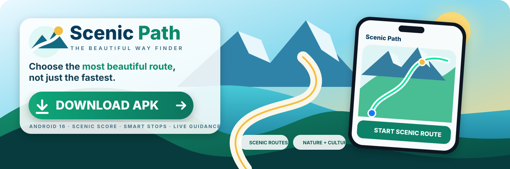
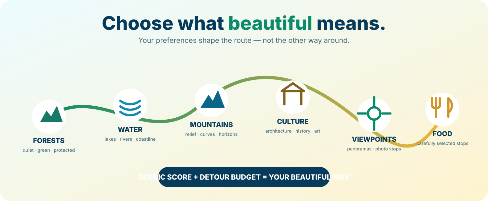

# Scenic Path — The Beautiful Way Finder

<div align="center">
  <a href="https://github.com/chekento/scenic-path-android/releases/download/v0.6.2-rc1/Scenic-Path-v0.6.2-rc1-debug.apk">
    
  </a>
</div>

<div align="center">

### **⬇️ [DOWNLOAD SCENIC PATH APK](https://github.com/chekento/scenic-path-android/releases/download/v0.6.2-rc1/Scenic-Path-v0.6.2-rc1-debug.apk)**

[Release page](https://github.com/chekento/scenic-path-android/releases/tag/v0.6.2-rc1) · Package `cloud.kosch.scenicpath` · Android 16 / API 36 · RC test build

</div>

**Scenic Path** is a map-first Android journey planner that optimizes for the **quality of the journey**, not only time or distance.

> **Choose the most beautiful route, not just the fastest.**

<div align="center">
  
</div>

## What Scenic Path optimizes

Scenic Path lets the user define what *beautiful* means for a trip:

- quiet, winding and scenic roads
- forests and protected landscapes
- lakes, rivers and coastline
- mountains, relief and viewpoints
- historic sights, monuments, architecture and culture
- parks and gardens
- carefully selected food stops

The user also defines a **detour budget**. Candidate journeys are ranked with a **ScenicScore**, and the route planner keeps scenic upgrades within the configured extra-time budget.

## Current Android build — v0.6.2-rc1

- `versionCode 39`
- package `cloud.kosch.scenicpath`
- Kotlin + Jetpack Compose
- MapLibre Native map
- start/destination search including addresses and landmarks
- ScenicScore-based route candidates
- Smart Stops and fixed Scenic POIs
- route-corridor POI discovery
- configurable scenic categories and detour budget
- live GPS navigation HUD
- route progress, speed, ETA and follow camera
- off-route detection and reroute action
- next Scenic POI and arrival detection
- Android TTS alerts
- privacy/security boundary that keeps reusable provider credentials out of the APK

## APK download

The large **Download APK** graphic at the top of this README is itself the download link.

**Direct APK:**  
https://github.com/chekento/scenic-path-android/releases/download/v0.6.2-rc1/Scenic-Path-v0.6.2-rc1-debug.apk

**SHA-256 file:**  
https://github.com/chekento/scenic-path-android/releases/download/v0.6.2-rc1/Scenic-Path-v0.6.2-rc1-debug.apk.sha256

The repository workflow `.github/workflows/github-release-apk.yml` builds the installable test APK on `main` and publishes it to the GitHub Release so the frontpage link stays useful instead of pointing at a transient Actions artifact.

> This is an **RC/debug test APK**, not the final Play Store production-signed package.

## How routing differs

A conventional navigation app primarily optimizes time or distance. Scenic Path treats the **route corridor itself** as the experience. POIs are optional experience anchors, while road character, surrounding landscape, route geometry and the selected scenic categories contribute to the journey score.

Mandatory user-selected POIs stay hard routing breaks. Flexible scenic upgrades compete for the remaining global detour budget rather than adding independent loops to every leg.

## Development

### Android

1. Copy `local.properties.example` to `local.properties`.
2. Start the backend if you are testing the configured backend path.
3. Open the project in Android Studio and run the `app` configuration.

### Backend

```bash
cd backend
cp .env.example .env
TOMTOM_API_KEY=... npm start
```

- Health check: `GET /health`
- Route endpoint: `POST /v1/plan`

Public OpenStreetMap, Photon, Nominatim, Overpass and Valhalla endpoints are development/test infrastructure. Production deployment should use controlled/self-hosted or contracted providers and comply with provider attribution and usage requirements.

## Security

Do not commit reusable TomTom, Google Places or other server credentials to the Android app. Scenic Path keeps the provider boundary server-side for production configurations.

## License

No open-source license has been selected yet. Until the owner chooses one, normal copyright rules apply.
