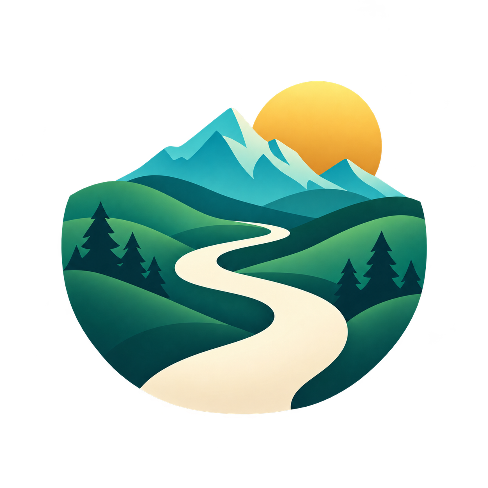

# Scenic Path — The Beautiful Way Finder

<div align="center">
  
  <br />
  <a href="https://github.com/chekento/scenic-path-android/releases/download/v0.7.3-rc2/Scenic-Path-v0.7.3-rc2-debug.apk">
    
  </a>
</div>

<div align="center">

## ⬇️ [DOWNLOAD SCENIC PATH v0.7.3-rc2 APK](https://github.com/chekento/scenic-path-android/releases/download/v0.7.3-rc2/Scenic-Path-v0.7.3-rc2-debug.apk)

**Tap the large hero image above or the download text here — both point directly to the current APK.**

[Release notes](https://github.com/chekento/scenic-path-android/releases/tag/v0.7.3-rc2) ·
[SHA-256](https://github.com/chekento/scenic-path-android/releases/download/v0.7.3-rc2/Scenic-Path-v0.7.3-rc2-debug.apk.sha256)

`cloud.kosch.scenicpath` · Android 16 / API 36 · `versionCode 47` · stability RC

</div>

---

<div align="center">
  
</div>

**Scenic Path** is a map-first Android journey planner built around one simple idea:

> **Choose the most beautiful route, not just the fastest.**

Instead of treating scenery as an afterthought, Scenic Path scores the **journey corridor itself** and lets the user decide how much extra time a more rewarding route is worth.

<div align="center">
  
</div>

The emblem shown above is the **same canonical brand asset used by the Android launcher/APK icon**. CI verifies that the repository preview and Android foreground resource stay byte-identical.

## Choose what beautiful means

<div align="center">
  
</div>

Scenic Path can shape a journey around:

- 🌲 **Forests & protected landscapes**
- 🌊 **Lakes, rivers & coastline**
- ⛰️ **Mountains, relief & viewpoints**
- 🏛️ **Historic sights, monuments, architecture & culture**
- 🌳 **Parks & gardens**
- 🍽️ **Carefully selected food stops**
- 🛣️ **Quiet, winding & scenic roads**

The user defines a **detour budget** in extra time. Candidate journeys are ranked with a **ScenicScore**, and scenic upgrades stay inside that global budget instead of adding uncontrolled loops.

## Journey beautifully

<div align="center">
  
</div>

| Layer | What it does |
|---|---|
| **ScenicScore** | Ranks route quality instead of optimizing only time or distance |
| **Experience anchors** | Adds viewpoints, culture, nature, Smart Stops and optional food destinations |
| **Detour control** | Keeps the complete journey within the user-selected extra-time budget |

## Original Scenic Path search stack

v0.7 keeps the original multi-lane search/discovery model instead of replacing it with a single provider shortcut.

### Start & destination search

- **Photon / OpenStreetMap type-ahead** for fast suggestions, typo tolerance and location bias.
- **Nominatim exact-address lookup** only when the user explicitly presses Search, including street + house number queries.
- **Android/device + backend lane** remains available for broad place coverage and configured production services.
- `OriginalSearchStack` runs the independent lanes concurrently, isolates provider failures, ranks the combined results and removes duplicates after ranking.

### Scenic route discovery

The route corridor continues to use the original discovery layers in parallel:

- `RapidRoutePoiDiscovery`
- `FastRoutePoiDiscovery`
- `PrecisionRoutePoiDiscovery`
- `RoutePoiCoverageDiscovery`
- Photon/OSM fallback and corridor discovery where applicable

CI checks the presence and call-sites of these algorithms before an APK can be published. Unit tests cover exact-address priority, cross-provider de-duplication and result limits.

## Current Android build — v0.7.3-rc2

Build 47 strengthens long journeys that exceeded a routing-service distance limit. A complete road-network corridor is divided into bounded sections, each recalculated with the selected vehicle profile. Automatically generated corridor anchors are matched without contradictory hard endpoint filters, so a valid international road corridor is not rejected at an intermediate point.

Road routing now commits independently from public POI enrichment. The map immediately starts a progressive full-route scan and keeps an animated status indicator visible while scenic places are still being searched. A slow or temporarily empty POI provider can no longer delay or invalidate a valid A→B route.

The start picker now offers a direct current-GPS action, including a clear permission/accuracy state, so the user does not have to search for their own location manually.

Address suggestions now appear progressively, remain stable during GPS updates, and support an explicit exact-address search while other providers are still loading. Route requests can be cancelled; older replies cannot replace newer input. The journey and search drafts survive screen rotation.

Dense POI sessions now use native map clusters, bounded result buffers and background selection. GPS updates no longer reload the entire route. Background requests cancel promptly, and Smart Stops reuses discoveries already on the map.

POI memory is now route-owned: changing from New York → Los Angeles to another journey clears the old pool immediately and late provider responses cannot return. The progressive scanner drains completed partial batches and has a hard wall-clock safety deadline, while valid candidate icons remain visible at city zoom levels. Smart Stops can automatically promote route-wide, well-spaced POIs into actual waypoints.

Exploration time now supports presets from minutes through multiple weeks and a free field (`18h`, `3d`, `2w`, or minutes). The scenic search corridor and automatic waypoint capacity expand with the selected time, up to a 30-day planning horizon.

The new landscape-and-path icon is shared by the launcher, the in-app header and this page. Android themed icons are supported.

[Changelog](CHANGELOG.md) · [Technical validation](docs/STABILITY_0.7.3.md)

The current installable GitHub APK includes:

- Kotlin + Jetpack Compose UI
- MapLibre Native map
- original multi-provider address/place search
- exact street + house-number lookup
- ScenicScore-based route candidates
- Smart Stops and fixed Scenic POIs
- original Fast/Rapid/Precision route-corridor POI discovery
- configurable scenic categories and detour budget
- live GPS navigation HUD
- route progress, remaining distance, ETA and current speed
- tilted follow camera and route overview
- off-route detection and reroute action
- next fixed Scenic POI and arrival detection
- Android TTS alerts
- provider boundary that keeps reusable production credentials out of the APK
- corrected Scenic Path wordmark
- canonical Scenic Path emblem shared by GitHub and the Android launcher icon

### APK

**Direct download:**  
[Scenic-Path-v0.7.3-rc2-debug.apk](https://github.com/chekento/scenic-path-android/releases/download/v0.7.3-rc2/Scenic-Path-v0.7.3-rc2-debug.apk)

**Integrity:**  
[Scenic-Path-v0.7.3-rc2-debug.apk.sha256](https://github.com/chekento/scenic-path-android/releases/download/v0.7.3-rc2/Scenic-Path-v0.7.3-rc2-debug.apk.sha256)

> This is an **installable RC/debug test APK**. It is not the final Play Store production-signed package.

## Why the routing model is different

Conventional navigation primarily optimizes time or distance. Scenic Path treats the **route corridor as part of the destination**.

A clean A→B route is the baseline. User-selected mandatory POIs remain hard routing breaks. Optional scenic upgrades then compete for the remaining global detour budget by experience gain per extra minute, rather than independently adding scenic loops to every leg.

That architecture is intended to make scenic routing both **expressive and controllable**.

## Repository & CI/CD

- Package: `cloud.kosch.scenicpath`
- Target SDK: `36`
- Current version: `0.7.3-rc2`
- GitHub APK release: [`v0.7.3-rc2`](https://github.com/chekento/scenic-path-android/releases/tag/v0.7.3-rc2)
- APK publishing workflow: `.github/workflows/github-release-apk.yml`

Before publishing, CI validates the brand contract, original search-algorithm contract, unit tests, Android build and lint. The publishing workflow derives the APK/release name from `versionName` so future releases do not require hard-coded download filenames in the build logic.

## Development

### Android

1. Copy `local.properties.example` to `local.properties`.
2. Start the backend if testing the configured backend route.
3. Open the project in Android Studio and run the `app` configuration.

### Backend

```bash
cd backend
cp .env.example .env
TOMTOM_API_KEY=... npm start
```

- Health check: `GET /health`
- Route endpoint: `POST /v1/plan`

Public OpenStreetMap, Photon, Nominatim, Overpass and Valhalla endpoints are development/test infrastructure. Production deployment should use controlled/self-hosted or contracted providers and comply with provider attribution and usage requirements.

## Security

Do not commit reusable TomTom, Google Places or other server credentials to the Android app. Scenic Path keeps the provider boundary server-side for production configurations.

## License

No open-source license has been selected yet. Until the owner chooses one, normal copyright rules apply.
